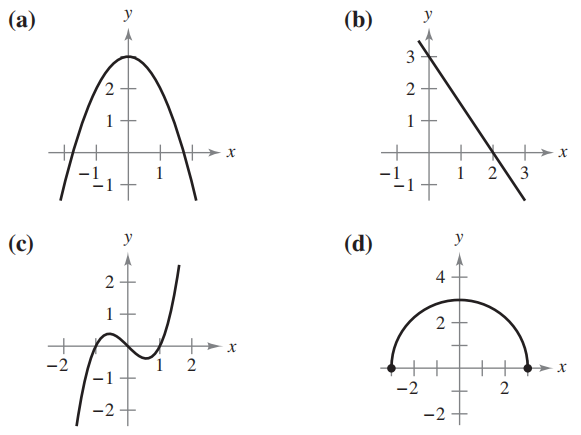

# P - PREPARACIÓN PARA EL CÁLCULO

**Corespondencia**. En los ejercicios 1 a 4, relacione cada ecuación con su gráfica [Las gráficas están etiquetadas (a), (b), (c) y (d).]

1. $y = -\frac{3}{2}x + 2$ (b)

2. $y = \sqrt{9 - x^2}$ (d)

3. $y = 3 - x^2$ (a)

4. $y = x^3 - x$ (c)
